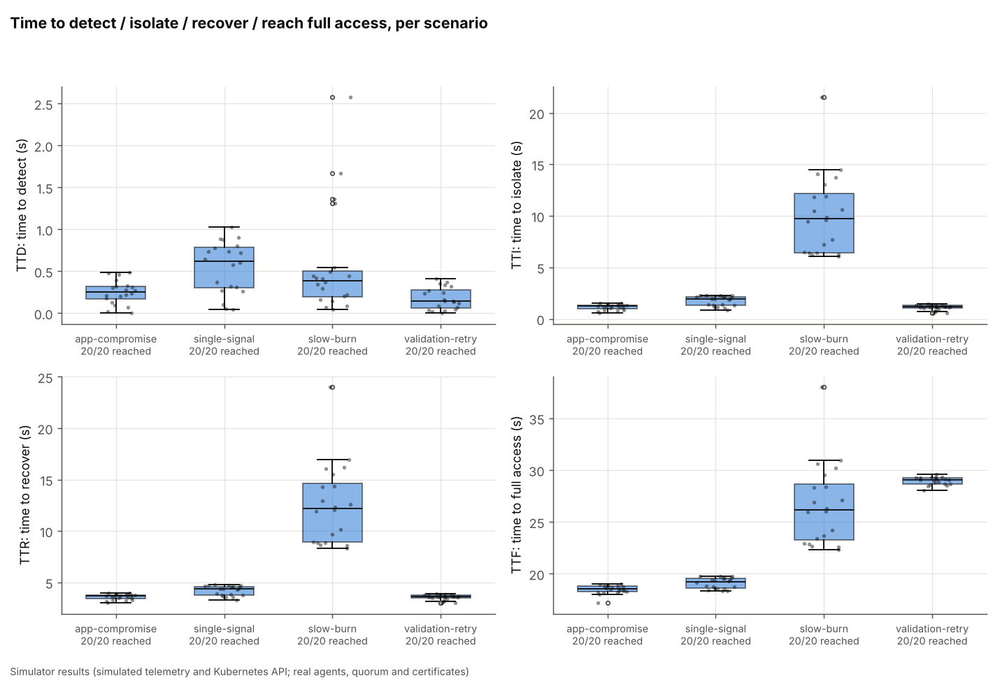
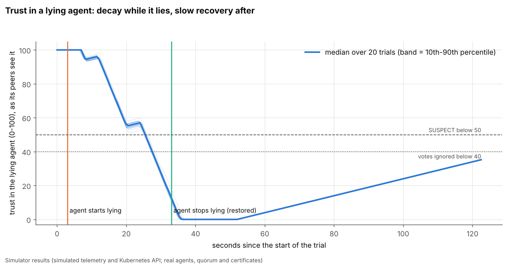
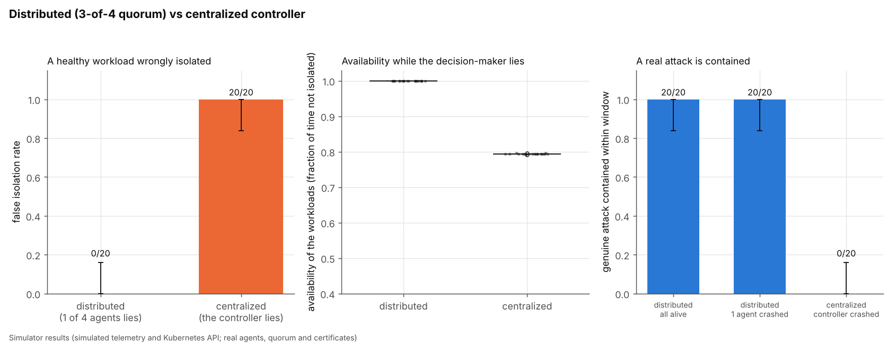
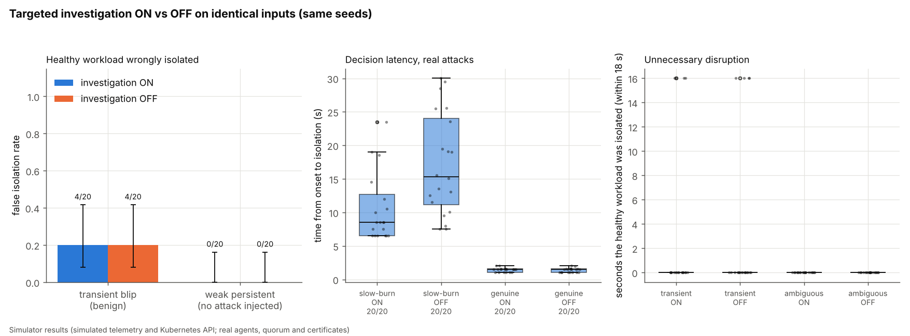
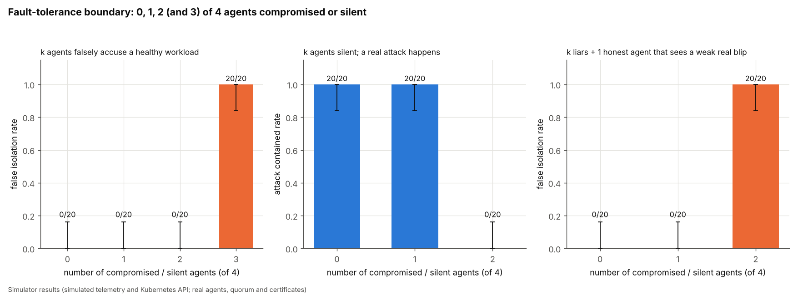
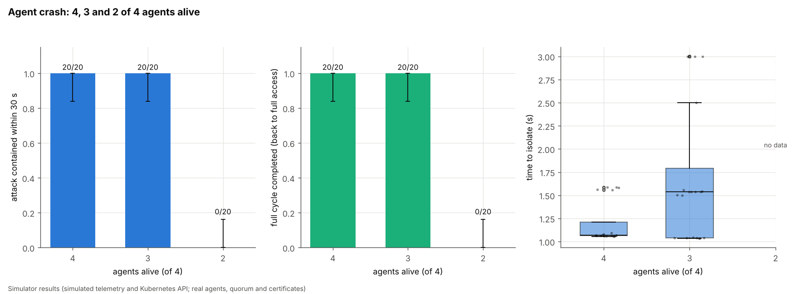
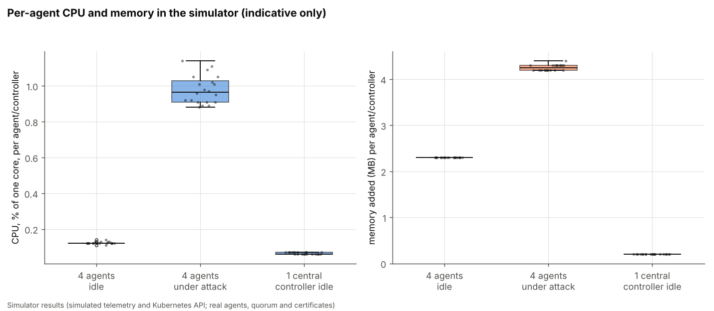
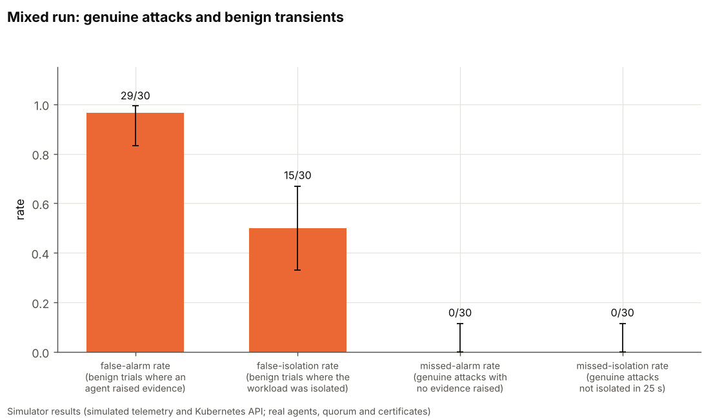

# Evaluation results (Phase 5)

> **These are simulator results.** Telemetry (what the monitored workloads look like) and the Kubernetes API are
> simulated (`sim/world.py`). Everything above that line is the real code: the agents, Ed25519 signatures, gRPC over mTLS
> on localhost, weighted evidence, the 3-of-4 quorum, quorum certificates and the admission policy, the recovery pipeline.
> Nothing here was measured on a real cluster, so absolute times (for example "recovery takes 3.5 s") say nothing about
> real Kubernetes, where a pod takes tens of seconds to start. What carries over is the **shape**: who gets isolated, who does
> not, what survives a failure. Every graph is stamped "Simulator results".


## 0. The results in ten lines (all simulator results; numbers from the tables below)

1. Every scenario trial (80 of 80) ran through detection, isolation, recovery and reintegration; a genuine attack was isolated in about 1.2 s and back at full access in about 18.5 s of simulator time.
2. One lying agent never isolated a healthy workload (0/20); a lying *central controller* did every time (20/20). With the controller crashed, a real attack was not contained (0/20); with one agent crashed it was (20/20).
3. The price of that safety: containment takes about 1.5 s instead of 0.5 s.
4. A lying agent is marked suspect after about 22 s and ignored after about 25 s, and takes well over 90 s to be forgiven.
5. **Where it breaks:** 3 of 4 compromised agents isolate a healthy workload (20/20); 2 compromised agents plus one honest agent that sees a weak blip also do (20/20); 2 silent agents mean no containment (0/20). One compromised agent never broke anything.
6. With 3 of 4 agents alive the full cycle completes (20/20); with 2 nothing is isolated, and nothing healthy is isolated either.
7. The targeted investigation did **not** reduce false isolations in my transient mix (4/20 both ways); it made real slow-burn attacks isolate sooner (20/20 pairs, median 4.2 s earlier) and turned silent ambiguity into a human-review flag.
8. In a mixed run, no genuine attack was missed (0/30), but 50% of benign transients were isolated, all of them ones that 3 or more agents saw. A threshold detector cannot tell a unanimous benign spike from an attack.
9. Agent CPU/memory in the simulator is tiny (about 0.1-1% of a core, 2-4 MB per agent), which says little about real clusters.
10. Nothing here was measured on a real cluster.

Everything in this file is produced by one command, so you can reproduce and check it:

```bash
python3 -m pip install -r requirements-dev.txt matplotlib   # matplotlib is only needed for the graphs
python3 scripts/evaluate.py                                  # about 2 hours on a 4-core laptop; resumable
python3 scripts/evaluate.py --quick --out /tmp/quick         # 3 trials per variant, a smoke test (about 5 minutes)
python3 scripts/evaluate.py --report-only                    # rebuild CSVs, graphs and the tables below from results/raw/trials.jsonl
```

The tables below the `<!-- BEGIN -->` markers are **rewritten by the script**; the explanation around them is hand-written.

## 1. What was run, and how to trust it

* Every **variant** (a scenario or a configuration) is run **20 times**, except the mixed run (30 genuine + 30 benign) and the
  trust experiment (20). Each run is one fresh simulated cluster: four real agents, fresh keys and certificates.
* Each trial has an integer **seed** (`results/*_trials.csv`, column `seed`). The seed fixes the trial's **inputs**: which workload
  is attacked, which agents are compromised or crashed, signal levels, durations, start delays. It does **not** make the timings
  bit-identical (thread scheduling, the OS and random ids still vary), so a re-run gives similar, not identical, numbers.
* **Identical inputs where comparisons are made:** investigation ON and OFF use the same seed per pair (same blip, same observers, same
  levels); distributed and centralized use the same seed per pair (same target / same accused workload).
* **Nothing is dropped, nothing is invented.** If a trial never reaches an endpoint (for example the attack is never contained) the cell
  is empty and the `outcome` column says why (`not_contained`, `contained_not_reintegrated`). Times are summarised only over
  trials that reached the endpoint, and every table shows how many did ("n="). A trial that crashed or timed out is recorded as
  `error`, excluded from rates, and counted below.
* **Rates carry a 95% confidence interval** (Wilson). With 20 trials a "0 of 20" still allows a true rate up to about 16%; it is evidence,
  not proof.
* Trials run 3 at a time on a 4-core machine. Times are measured on the wall clock, so heavy load can lengthen them slightly; the
  overhead experiment (section 4.7) runs alone for that reason.

<!-- BEGIN:errors -->
All 760 trials produced a result (0 errors).
<!-- END:errors -->

<!-- BEGIN:overview -->
| Experiment | Variant | Trials run | Trials that errored | Seeds |
|---|---|---|---|---|
| scenario | app-compromise | 20 | 0 | 1000-1019 |
| scenario | single-signal | 20 | 0 | 1100-1119 |
| scenario | slow-burn | 20 | 0 | 1200-1219 |
| scenario | validation-retry | 20 | 0 | 1300-1319 |
| trust | lying-agent | 20 | 0 | 2000-2019 |
| dvc | genuine-dist | 20 | 0 | 3000-3019 |
| dvc | genuine-central | 20 | 0 | 3000-3019 |
| dvc | accuse-dist | 20 | 0 | 3100-3119 |
| dvc | accuse-central | 20 | 0 | 3100-3119 |
| dvc | crash-dist | 20 | 0 | 3200-3219 |
| dvc | crash-central | 20 | 0 | 3200-3219 |
| investigation | transient-on | 20 | 0 | 4000-4019 |
| investigation | transient-off | 20 | 0 | 4000-4019 |
| investigation | slow-burn-on | 20 | 0 | 4100-4119 |
| investigation | slow-burn-off | 20 | 0 | 4100-4119 |
| investigation | ambiguous-on | 20 | 0 | 4200-4219 |
| investigation | ambiguous-off | 20 | 0 | 4200-4219 |
| investigation | genuine-on | 20 | 0 | 4300-4319 |
| investigation | genuine-off | 20 | 0 | 4300-4319 |
| fault | accuse-k0 | 20 | 0 | 5000-5019 |
| fault | accuse-k1 | 20 | 0 | 5100-5119 |
| fault | accuse-k2 | 20 | 0 | 5200-5219 |
| fault | accuse-k3 | 20 | 0 | 5300-5319 |
| fault | silent-k0 | 20 | 0 | 5400-5419 |
| fault | silent-k1 | 20 | 0 | 5500-5519 |
| fault | silent-k2 | 20 | 0 | 5600-5619 |
| fault | deceived-k0 | 20 | 0 | 5700-5719 |
| fault | deceived-k1 | 20 | 0 | 5800-5819 |
| fault | deceived-k2 | 20 | 0 | 5900-5919 |
| crash | alive4 | 20 | 0 | 6000-6019 |
| crash | alive3 | 20 | 0 | 6100-6119 |
| crash | alive2 | 20 | 0 | 6200-6219 |
| mixed | genuine | 30 | 0 | 7000-7029 |
| mixed | benign | 30 | 0 | 7100-7129 |
| overhead | idle | 20 | 0 | 8000-8019 |
| overhead | attack | 20 | 0 | 8100-8119 |
| overhead | central-idle | 20 | 0 | 8200-8219 |
<!-- END:overview -->

## 2. Definitions (start event, end event, denominator)

Common terms. **Injection time `t0`**: the instant the harness starts the attack or disturbance and writes the attack marker (this is what
the platform's own incident metrics use). **Target**: the workload the trial is about. **Isolated**: a quorum committed CONTAIN for the
target *and* the quarantine NetworkPolicy exists in the (simulated) cluster.

| Metric | Start event | End event | Denominator / how summarised |
|---|---|---|---|
| **TTD** time to detect | `t0` | the first time **any** agent's own detector rates the target at or above `local_min_conf` (0.5) | trials where it happened; median, IQR |
| **TTI** time to isolate | `t0` | the first agent that confirms the quarantine policy in the cluster | trials where it happened |
| **TTR** time to recover | `t0` | the first agent that sees the replacement pod ready *and* the old pods gone | trials where it happened |
| **TTV** time to validate | `t0` | the validation quorum (health, file hashes, no anomaly, new instance) commits | trials where it happened |
| **TTF** time to full access | `t0` | the first agent that confirms HEALTHY, which since Phase 4 means the cluster shows the isolation policy is **gone** | trials where it happened |
| **Reached full access** | | all four agents HEALTHY at stage FULL within the wait limit (120 s; 150 s with failed validation; 60 s to contain) | all trials of the variant |
| **Alarm** | | any agent **signed and broadcast evidence** about the target with confidence >= `evidence_min_conf` (0.3) | trials of the class |
| **False alarm** | | an alarm in a trial where **no attack was injected** (a benign transient) | benign trials. A wrong *detection*. Nothing is disrupted yet. |
| **Missed alarm** (false negative, alarm level) | | no agent signed evidence >= 0.3 in a trial with a **genuine attack** | genuine trials |
| **False isolation** | | the quorum committed CONTAIN (an incident version >= 1 on some agent) for a workload that was **not** under attack. A wrong *action*: an **unnecessary disruption**. | benign trials |
| **Missed isolation** (false negative, action level) | | a genuine attack not isolated within the window (25 s unless stated) | genuine trials |
| **Unnecessary disruption** | policy first applied to a healthy workload | end of the observation window (18 s) | seconds the healthy workload spent isolated, sampled every 0.5 s. **Right-censored**: a longer window would show more. |
| **Benign-workload availability** | window start | window end | fraction of (0.5 s sample x workload) pairs in which the workload had **no** isolation policy. It counts policy presence, not whether requests succeeded. |
| **Decision latency** | `t0` (onset of the attack/anomaly) | the first agent that confirms the isolation | genuine-attack trials where it happened |
| **Trust trajectory** | the liar starts lying | each honest agent's trust value in the liar, sampled every 0.5 s | min / mean / max over the honest agents |
| **SUSPECT** | | an honest agent's trust in a peer < 50 | |
| **Vote exclusion** | | trust in a peer < 40: its votes and evidence are no longer counted | |
| **CPU %** | start of window | end of window | process CPU time (user+system) / wall time / number of agents, as a % of one core |
| **Memory added** | before the cluster is built | after it ran | process RSS growth / number of agents |
| **False-positive rate** | | false isolations (or false alarms) / benign trials | **depends entirely on the benign mix chosen** (section 4.8) |
| **False-negative rate** | | missed isolations (or alarms) / genuine trials | likewise |
| **Precision / recall** | | TP / (TP+FP) and TP / genuine trials, at isolation level | |

A **false alarm** and a **false isolation** are different failures. A false alarm is one agent (or several) wrongly *suspecting* a
workload; the quorum and the investigation exist precisely so that this does not turn into an action. A false isolation is the
costly one: a healthy workload is cut off.

## 3. The experiments in one paragraph each

| Experiment | Inputs | Trials |
|---|---|---|
| **scenario** | genuine compromise (all signals, random target and start delay); single-signal attack; slow burn (weak anomaly that grows, seen by two agents first); first replacement pod fails validation | 4 x 20 |
| **trust** | one random agent lies for 30 s (fabricated evidence + votes against a healthy workload), then is restored; 90 s of recovery observed | 20 |
| **dvc** (distributed vs centralized) | same seeds: (a) the decision-maker lies about a healthy workload; (b) a genuine attack; (c) the decision-maker crashes first, then a genuine attack | 6 x 20 |
| **investigation** | the same inputs with the investigation feature ON and OFF: transient blip, weak persistent signal, slow burn, genuine attack | 8 x 20 |
| **fault** | k = 0..3 liars accusing a healthy workload; k = 0..2 liars plus one honest agent that sees a weak real blip; k = 0..2 agents silent during a real attack | 10 x 20 |
| **crash** | 4, 3 or 2 agents alive, then a genuine attack | 3 x 20 |
| **mixed** | 30 genuine attacks and 30 benign transients, random strength and visibility | 60 |
| **overhead** | 4 agents idle; 4 agents during an attack; one central controller idle | 3 x 20, run alone |

## 4. Results

### 4.1 Detection, isolation, recovery and full access per scenario

<!-- BEGIN:scenario -->
| Scenario | Trials | Reached full access | TTD (s) | TTI (s) | TTR (s) | TTF (s) |
|---|---|---|---|---|---|---|
| app-compromise | 20 | 20/20 | median 0.3 (IQR 0.2-0.3<br>min 0.0, max 0.5, n=20) | median 1.2 (IQR 1.0-1.4<br>min 0.6, max 1.6, n=20) | median 3.7 (IQR 3.4-3.8<br>min 3.0, max 4.0, n=20) | median 18.5 (IQR 18.3-18.8<br>min 17.2, max 19.0, n=20) |
| single-signal | 20 | 20/20 | median 0.6 (IQR 0.3-0.8<br>min 0.0, max 1.0, n=20) | median 1.9 (IQR 1.3-2.1<br>min 0.9, max 2.3, n=20) | median 4.4 (IQR 3.8-4.6<br>min 3.3, max 4.8, n=20) | median 19.2 (IQR 18.6-19.5<br>min 18.3, max 19.7, n=20) |
| slow-burn | 20 | 20/20 | median 0.4 (IQR 0.2-0.5<br>min 0.0, max 2.6, n=20) | median 9.7 (IQR 6.4-12.2<br>min 6.1, max 21.5, n=20) | median 12.2 (IQR 8.9-14.7<br>min 8.3, max 24.0, n=20) | median 26.2 (IQR 23.3-28.7<br>min 22.3, max 38.0, n=20) |
| validation-retry | 20 | 20/20 | median 0.1 (IQR 0.1-0.3<br>min 0.0, max 0.4, n=20) | median 1.2 (IQR 1.0-1.3<br>min 0.6, max 1.5, n=20) | median 3.6 (IQR 3.5-3.7<br>min 3.0, max 3.9, n=20) | median 29.1 (IQR 28.7-29.3<br>min 28.0, max 29.6, n=20) |
<!-- END:scenario -->



**How to read it.** Each box is one scenario over its trials: the line is the median, the box covers the middle half (25th-75th percentile), the whiskers
the rest apart from outliers (dots). Under each name is "x/y reached": how many trials got that far. Lower is faster.
Times are small because the simulator compresses all timers (0.5 s ticks, 3 s per reintegration stage, 2 s for a "pod" to start); relative
differences between scenarios, not the seconds, are the point. **What the data shows.** All 80 trials reached full access (no trial stalled). A genuine multi-signal compromise was detected in a median 0.3 s, isolated in 1.2 s, recovered in 3.7 s and back at full access in 18.5 s (most of the time after recovery is the four staged reintegration steps, each with a 3 s minimum dwell, plus the trust-gated waits). A single-signal attack is slightly slower to isolate (1.9 s): I did not isolate the cause; one weaker signal plausibly takes a little longer to gather three agreeing votes. The **slow burn** is the slowest to isolate (median 9.7 s, up to 21.5 s) because the signal starts weak and only some agents see it first; the platform waits for it to persist and grow, which is the intended trade-off. **Validation-retry** isolates and recovers as fast as a normal attack (its TTR is the *first*, bad, replacement) but reaches full access later (29.1 s against 18.5 s): one failed validation plus back-off costs about 10 s in simulator time. Timing spreads are narrow because the simulator is largely deterministic; real systems will be noisier.

### 4.2 Trust in a lying agent

<!-- BEGIN:trust -->
| Quantity | Result |
|---|---|
| Trials | 20 |
| Time until the first honest agent marks the liar SUSPECT (<50), s after it starts lying | median 22.5 (IQR 22.5-22.5, min 17.5, max 23.0, n=20) |
| Time until a vote-exclusion (<40) | median 24.5 (IQR 24.5-24.5, min 24.0, max 25.0, n=20) |
| Lowest trust any honest agent reached | median 0.0 (IQR 0.0-0.0, min 0.0, max 0.0, n=20) |
| Time after it stops lying until mean trust is back above 50, s | n/a (no trial reached it) |
| Mean trust at the end (90 s after it stopped) | median 35.3 (IQR 35.2-35.3, min 35.0, max 35.3, n=20) |
| Healthy victim wrongly isolated | 0/20 = 0% (95% CI 0-16%) |
<!-- END:trust -->



**How to read it.** One thin line per trial is the average trust the three honest agents place in the liar. The thick line is the median, the band
the 10th-90th percentile. Trust starts at 100. While the agent lies, its claims are contradicted by what the honest agents see themselves, so its trust falls. It crosses
the SUSPECT line (50) and then the vote-exclusion line (40), after which its votes and evidence are ignored. When it stops lying, trust climbs back, but slowly
(0.5 per second): the platform is deliberately slow to forgive. **What the data shows.** The honest agents first marked the liar SUSPECT about 22.5 s after it started lying (range 17.5-23 s) and stopped counting its votes about 2 s later (24.5 s). Trust fell to 0 in every trial. In **no** trial did the lie isolate the victim (0/20, 95% CI 0-16%), because one liar never reaches 3 signatures. After the agent was restored, trust stayed at 0 for about 15 s (its old fabricated evidence was still inside the 20 s evidence window), then climbed at 0.5 per second and was only about 35 after 90 s; **no trial got back above 50 within the observation**. Going from 0 to 50 takes at least 100 s at that rate. In other words forgiveness is deliberately much slower than suspicion. Note the 20 curves nearly coincide because the simulated dynamics are deterministic; the spread in a real cluster would be wider. Also note the first ~20 s: the platform is robust to the lie *because of the quorum*, not because trust has already dropped.

### 4.3 Distributed vs centralized

<!-- BEGIN:dvc -->
| Condition | Result |
|---|---|
| Distributed, 1 agent lies about a healthy workload: false isolation | 0/20 = 0% (95% CI 0-16%) |
| Centralized, the controller lies: false isolation | 20/20 = 100% (95% CI 84-100%) |
| Distributed, availability while an agent lies | median 1.000 (IQR 1.000-1.000, min 1.000, max 1.000, n=20) |
| Centralized, availability while the controller lies | median 0.794 (IQR 0.794-0.794, min 0.791, max 0.797, n=20) |
| Distributed, all alive: real attack contained | 20/20 = 100% (95% CI 84-100%) |
| Distributed, 1 agent crashed first: real attack contained | 20/20 = 100% (95% CI 84-100%) |
| Centralized, controller alive: real attack contained | 20/20 = 100% (95% CI 84-100%) |
| Centralized, controller crashed first: real attack contained | 0/20 = 0% (95% CI 0-16%) |
| Distributed, time to contain a real attack (s) | median 1.50 (IQR 1.25-1.51, min 1.01, max 1.75, n=20) |
| Centralized, time to contain a real attack (s) | median 0.50 (IQR 0.50-0.50, min 0.50, max 0.76, n=20) |
<!-- END:dvc -->



**How to read it.** Left: when the single decision-maker is compromised and lies, how often is a healthy workload wrongly isolated? Distributed: one of four agents
lies (it cannot reach a quorum alone). Centralized: the one controller lies (its word is final). Middle: the fraction of time the workloads stayed un-isolated while this
went on (higher is better; only the lie, not a real attack, is happening). Right: when a real attack occurs, how often is it contained, with all components alive, with one agent crashed,
and with the single controller crashed. Whiskers are 95% confidence intervals. **What the data shows.** When the single decision-maker lies, the centralized controller isolated a healthy workload in **20 of 20** trials (95% CI 84-100%), whereas with one lying agent among four the distributed platform did so in **0 of 20** (CI 0-16%). While it lied, the centralized system's workloads were available only 79% of the time (the accused workload was cut off for about 33 of the 40 s window); the distributed platform kept 100%. When the decision-maker **crashes** before a real attack, the centralized controller contained it in **0 of 20** trials, whereas the distributed platform with one agent crashed still contained **20 of 20**. The price: with all components healthy the centralized controller contained a real attack faster (median 0.5 s against 1.5 s), because a single controller needs no signatures, votes or certificate; the distributed platform spends about one extra second to be safe against a lying or crashed member. (The centralized baseline deliberately has no quorum or certificates; it is the comparison, not a design I am defending.)

### 4.4 Targeted investigation ON vs OFF

<!-- BEGIN:investigation -->
| Input | Investigation | Trials | Workload isolated | Isolated seconds (median, of 18 s) | Onset-to-isolation latency (s) | Human-review flag |
|---|---|---|---|---|---|---|
| transient (benign, no attack) | ON | 20 | 4/20 = 20% (95% CI 8-42%) | 0.0 | n/a (benign input) | 0/20 |
| transient (benign, no attack) | OFF | 20 | 4/20 = 20% (95% CI 8-42%) | 0.0 | n/a (benign input) | 0/20 |
| ambiguous (benign, no attack) | ON | 20 | 0/20 = 0% (95% CI 0-16%) | 0.0 | n/a (benign input) | 20/20 |
| ambiguous (benign, no attack) | OFF | 20 | 0/20 = 0% (95% CI 0-16%) | 0.0 | n/a (benign input) | 0/20 |
| slow-burn (real attack) | ON | 20 | 20/20 = 100% (95% CI 84-100%) | n/a | median 8.5 (IQR 6.5-12.7, min 6.5, max 23.5, n=20) | 0/20 |
| slow-burn (real attack) | OFF | 20 | 20/20 = 100% (95% CI 84-100%) | n/a | median 15.3 (IQR 11.1-24.1, min 7.5, max 30.0, n=20) | 0/20 |
| genuine (real attack) | ON | 20 | 20/20 = 100% (95% CI 84-100%) | n/a | median 1.5 (IQR 1.1-1.5, min 1.0, max 2.0, n=20) | 0/20 |
| genuine (real attack) | OFF | 20 | 20/20 = 100% (95% CI 84-100%) | n/a | median 1.5 (IQR 1.1-1.6, min 1.0, max 2.0, n=20) | 0/20 |
<!-- END:investigation -->



**How to read it.** Each pair of bars/boxes uses **identical inputs** (same seeds); only the investigation switch differs. Left: for benign inputs, how often was a healthy workload
isolated. Middle: for real attacks, how long from onset to isolation (does checking first cost time?). Right: for benign inputs, how many seconds the healthy workload was cut off.
The "weak persistent" input is a signal that no attack caused and that only two agents confirm; with the investigation ON it ends in a human-review flag instead of an action. **What the data shows, including what it does not show.**
* **Transient blip (benign):** 4 of 20 healthy workloads were isolated with the investigation ON and the same 4 with it OFF (identical trials; each was a spike seen by 3 of 4 agents, which satisfies the quorum on its own). Where only 1-2 agents saw the blip, neither configuration isolated anything, because the 3-vote quorum alone already refuses. So **in this input mix the investigation did not reduce false isolations**; it is not the thing that stops a 1-2-agent blip, the quorum is. I did not measure a benefit here and do not claim one.
* **Weak persistent signal (no attack injected, confirmed by 2 agents):** no isolation in either mode (0/20 each), but with the investigation ON all 20 ended in an explicit **human-review flag**, and with it OFF nothing was surfaced at all. The measurable gain is visibility, not fewer actions.
* **Slow burn (real attack):** with the investigation ON isolation came earlier in **20 of 20** paired trials (median 8.5 s against 15.3 s; the per-seed difference has median 4.2 s, range 0.5-19.0 s). Its targeted re-measurement lets agents that see a persistent weak anomaly vote sooner.
* **Genuine strong attack:** identical (median 1.5 s both): the investigation adds no delay when evidence is already clear.
Unnecessary disruption: the 4 isolated transient trials were each isolated for the rest of the 18 s window (right-censored; the dots on the right graph).

### 4.5 Fault-tolerance boundary

<!-- BEGIN:fault -->
| Test | Compromised / silent agents (k) | Trials | Outcome |
|---|---|---|---|
| k liars accuse a healthy workload: **false isolation** | 0 | 20 | 0/20 = 0% (95% CI 0-16%) |
| k liars accuse a healthy workload: **false isolation** | 1 | 20 | 0/20 = 0% (95% CI 0-16%) |
| k liars accuse a healthy workload: **false isolation** | 2 | 20 | 0/20 = 0% (95% CI 0-16%) |
| k liars accuse a healthy workload: **false isolation** | 3 | 20 | 20/20 = 100% (95% CI 84-100%) |
| k liars + 1 honest agent that sees a weak real blip: **false isolation** | 0 | 20 | 0/20 = 0% (95% CI 0-16%) |
| k liars + 1 honest agent that sees a weak real blip: **false isolation** | 1 | 20 | 0/20 = 0% (95% CI 0-16%) |
| k liars + 1 honest agent that sees a weak real blip: **false isolation** | 2 | 20 | 20/20 = 100% (95% CI 84-100%) |
| k agents silent, real attack: **contained** | 0 | 20 | 20/20 = 100% (95% CI 84-100%) |
| k agents silent, real attack: **contained** | 1 | 20 | 20/20 = 100% (95% CI 84-100%) |
| k agents silent, real attack: **contained** | 2 | 20 | 0/20 = 0% (95% CI 0-16%) |
<!-- END:fault -->



**How to read it.** Byzantine fault-tolerance theory says that with 4 agents and a quorum of 3, **1** compromised agent can be tolerated and **2** cannot (n >= 3f+1). Three tests probe the two ways
it can fail. *Left (safety):* k compromised agents all falsely accuse the same healthy workload; the honest agents see nothing wrong. *Middle (liveness):* k agents go silent
(equivalent to crashed or refusing to vote) while a real attack happens. *Right (deception):* k liars accuse a healthy workload that really does show a weak blip to exactly one honest agent,
the case where an honest agent can be tipped into voting. k = 3 is shown on the left only, beyond the theory's limit, to confirm the quorum is the only barrier. **What the data shows.**
* **Safety, accusation only (left):** 0, 1 and 2 liars never isolated the healthy workload (0/20 each; the honest agents do not vote without seeing the anomaly themselves); with **3** liars it happened in 20/20 (they alone make a valid certificate). So pure accusation is safe up to 2 compromised agents, one better than the theory's minimum.
* **Liveness (middle):** with 0 or 1 silent agents the attack was contained 20/20; with **2** silent agents **0/20**: only two votes were ever collected (the table's "most votes seen" is 2). This is the BFT bound showing exactly where theory predicts, for a crash-like fault.
* **Deception (right):** with 0 or 1 liars nothing was isolated (0/20), but with **2 liars plus one honest agent that really sees a weak blip** the healthy workload was isolated in **20/20**: the two liars' signatures plus the one deceived honest signature make three. **So 2 compromised agents out of 4 do break safety**, as theory says, though it needs a real anomaly for the honest agent to be deceived by.
Honest framing: the platform's guarantee is "1 compromised agent is tolerated"; at 2 it fails in two of the three ways tested. The tests are designed to find the breaking point, so they should be read as a boundary, not typical behaviour.

### 4.6 Agent crash

<!-- BEGIN:crash -->
| Agents alive | Trials | Attack contained (30 s) | Full cycle completed | Time to isolate (s) | Time to full access (s) | Most CONTAIN votes seen | Other workload wrongly isolated |
|---|---|---|---|---|---|---|---|
| 4 | 20 | 20/20 = 100% (95% CI 84-100%) | 20/20 = 100% (95% CI 84-100%) | median 1.1 (IQR 1.1-1.2, min 1.1, max 1.6, n=20) | median 18.5 (IQR 18.5-18.5, min 18.5, max 19.0, n=20) | 0 | 0/20 |
| 3 | 20 | 20/20 = 100% (95% CI 84-100%) | 20/20 = 100% (95% CI 84-100%) | median 1.5 (IQR 1.0-1.8, min 1.0, max 3.0, n=20) | median 19.0 (IQR 19.0-20.0, min 18.5, max 22.0, n=20) | 0 | 0/20 |
| 2 | 20 | 0/20 = 0% (95% CI 0-16%) | 0/20 = 0% (95% CI 0-16%) | n/a (no trial reached it) | n/a (no trial reached it) | 2 | 0/20 |
<!-- END:crash -->



**How to read it.** A real attack with 4, 3 and 2 agents alive. With 3 alive the three survivors can still form the 3-signature quorum and finish the whole pipeline. With 2 alive
there are not enough signatures, so nothing is isolated; the table shows how many votes the survivors collected. **What the data shows.** With 4 or 3 agents alive the attack was contained and the whole cycle completed in 20/20 trials (isolation median 1.1 s with 4, 1.5 s with 3; full access 18.5 s and 19.0 s). With **2** alive nothing was isolated (0/20): the survivors collected 2 votes and never the 3 needed. Importantly it **fails safe**: no healthy workload was isolated either (0/20). The cost is that during that time a genuine attack is not contained automatically; the dashboard shows the proposal waiting for votes, and a human has to act.

### 4.7 Agent overhead

<!-- BEGIN:overhead -->
| Configuration | Trials | CPU, % of one core, per unit | Memory added per unit (MB) | Whole process RSS (MB) |
|---|---|---|---|---|
| 4 agents, idle | 20 | median 0.1 (IQR 0.1-0.1, min 0.1, max 0.1, n=20) | median 2.3 (IQR 2.3-2.3, min 2.3, max 2.3, n=20) | median 58.7 (IQR 58.7-58.8, min 58.6, max 58.8, n=20) |
| 4 agents, during an attack + recovery | 20 | median 1.0 (IQR 0.9-1.0, min 0.9, max 1.1, n=20) | median 4.2 (IQR 4.2-4.3, min 4.2, max 4.4, n=20) | median 66.7 (IQR 66.5-66.8, min 66.3, max 67.1, n=20) |
| 1 central controller, idle | 20 | median 0.1 (IQR 0.1-0.1, min 0.1, max 0.1, n=20) | median 0.2 (IQR 0.2-0.2, min 0.2, max 0.2, n=20) | median 49.8 (IQR 49.7-49.8, min 49.7, max 49.9, n=20) |
<!-- END:overhead -->



**How to read it, and why to be careful.** In the simulator all four agents (plus their gRPC servers and the simulated telemetry) share **one** Python process, so these are the process's CPU and memory **divided by four**.
Real agents run in their own pods, poll real HTTP endpoints every second and talk to a real API server, so real numbers will differ (and each pod has the interpreter's baseline memory, which this
division does not capture). Treat the figure as "the agent logic is cheap", not as a sizing guide. For real numbers use `kubectl top pods -n resilience` on your cluster. **What the data shows.** Per agent, in the simulator: about 0.1% of one core when idle and about 1.0% during an attack and recovery; about 2.3 MB of memory added when idle and 4.2 MB during an attack. The single central controller is lighter (0.1% CPU, 0.2 MB) since it has no gRPC servers, signatures or votes. These are tiny because the simulated telemetry is free; the real agent's HTTP polling of four workloads every second will cost more. This supports "the decision logic is cheap" and nothing more.

### 4.8 False positives and false negatives in a mixed run

<!-- BEGIN:mixed -->
| Level | Quantity | Result |
|---|---|---|
| Alarm (evidence signed above 0.3 confidence) | false-alarm rate = FP / benign trials | 29/30 = 97% (95% CI 83-99%) |
| Alarm | missed-alarm rate (false negative) = FN / genuine trials | 0/30 = 0% (95% CI 0-11%) |
| Isolation (quorum committed) | false-isolation rate = FP / benign trials | 15/30 = 50% (95% CI 33-67%) |
| Isolation | missed-isolation rate (false negative) = FN / genuine trials | 0/30 = 0% (95% CI 0-11%) |
| Isolation | precision = TP / (TP + FP) | 67% |
| Isolation | recall = TP / genuine trials | 30/30 = 100% (95% CI 89-100%) |
<!-- END:mixed -->

<!-- BEGIN:mixed_strata -->
| Benign transient strength | Seen by | Trials | False alarm | False isolation |
|---|---|---|---|---|
| at or below the alert threshold (<= 8 connections) | 1-2 agents | 1 | 0/1 | 0/1 |
| moderate (9-16 connections, confidence 0.53-0.75) | 1-2 agents | 3 | 3/3 | 0/3 |
| moderate (9-16 connections, confidence 0.53-0.75) | 3-4 agents | 14 | 14/14 | 11/14 |
| strong (> 16 connections, confidence > 0.75) | 1-2 agents | 8 | 8/8 | 0/8 |
| strong (> 16 connections, confidence > 0.75) | 3-4 agents | 4 | 4/4 | 4/4 |
<!-- END:mixed_strata -->



**How to read it.** 30 genuine attacks (random mixes of the three attack signals, random target) and 30 benign transients (a short spike in outbound connections of random strength, seen by 1-4 agents,
or a long weak burst seen by all) are run through the full platform. The four bars are rates with 95% confidence intervals. **These rates are only as meaningful as the benign mix**: the benign
transients here were *chosen* to straddle the detection thresholds (the connection rule rates nothing up to 8 connections, then 0.5 at 9, rising to 1.0 at 24; the normal level is about 2), so some are harmless and some look
exactly like an attack. A production environment with calmer or noisier benign traffic would give different rates. The table that splits benign trials by strength shows where the line is. **What the data shows.** All 30 genuine attacks raised an alarm and were isolated (0/30 missed, 95% CI 0-11%). Of the 30 benign transients 29 raised an alarm (a false-alarm rate of 97%, which is expected: almost all were above the 8-connection threshold by construction) and **15 (50%, CI 33-67%) led to an isolation**. Precision at isolation level was 67%. The stratified table shows what decides it: **no benign transient was ever isolated when only 1-2 agents saw it (0 of 12 trials), and 15 of 18 were isolated when 3-4 agents saw it** (all four of the strong ones, 11 of 14 of the moderate ones; the 3 that were not were all at the weak end, 9.8-11.9 connections). In other words the platform's protection against false isolation is that **a benign disturbance has to be visible to three agents at once**. A transient that all agents see above the threshold is, to a threshold detector, indistinguishable from an attack. In the simulator partial visibility is a modelling choice (the `observers` set); in a real cluster all four agents poll the same endpoints, so most real spikes would be visible to all of them, and the 50% should be read as a stress-test bound for a deliberately hostile benign mix, not a prediction. This is the platform's main accuracy limit (Phase 2's investigation helps weak or disputed evidence, not unanimous ones).

## 5. Honest limitations of this evaluation

* **Simulated telemetry.** A "genuine attack" is a simulated signal pattern (outbound connections, a modified file hash, a suspicious process, failed logins). Nothing real is attacked or made to misbehave. The detector is a threshold
  detector, so any benign input beyond its thresholds is by construction indistinguishable from an attack at the single-agent level; what the platform adds is the quorum and the investigation.
* **Benign and attack mixes are my choice**, so the false-positive/negative rates are illustrations of behaviour under a stated mix, not estimates of real-world rates.
* **Seeds fix inputs, not timings** (section 1). With 20 trials per variant, small differences between medians are noise; differences are only worth quoting where the confidence intervals or interquartile ranges do not overlap.
* **No real Kubernetes:** no real pod start times, no Calico enforcement, no API latency; those are what `scripts/verify-isolation.sh`, `verify-rbac.sh` and `verify-webhook.sh` are for.
* **Silent agents are crashed agents** (the simulator has no "stay alive but refuse to vote" mode); for the liveness question they are equivalent.
* Parallel trials share one machine; the CPU/memory experiment is serial for that reason, but it is still a single-process approximation.
* The 2-of-4 safety break shown in the "deceived" test is a property of any 3-of-4 quorum, not a bug: see `docs/SECURITY.md` section 1.
